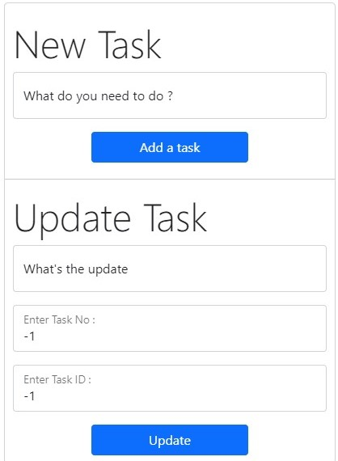
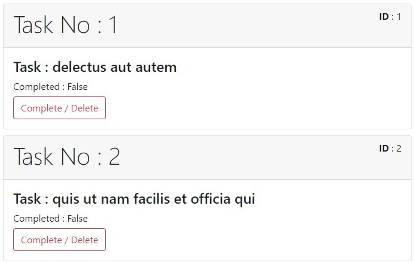
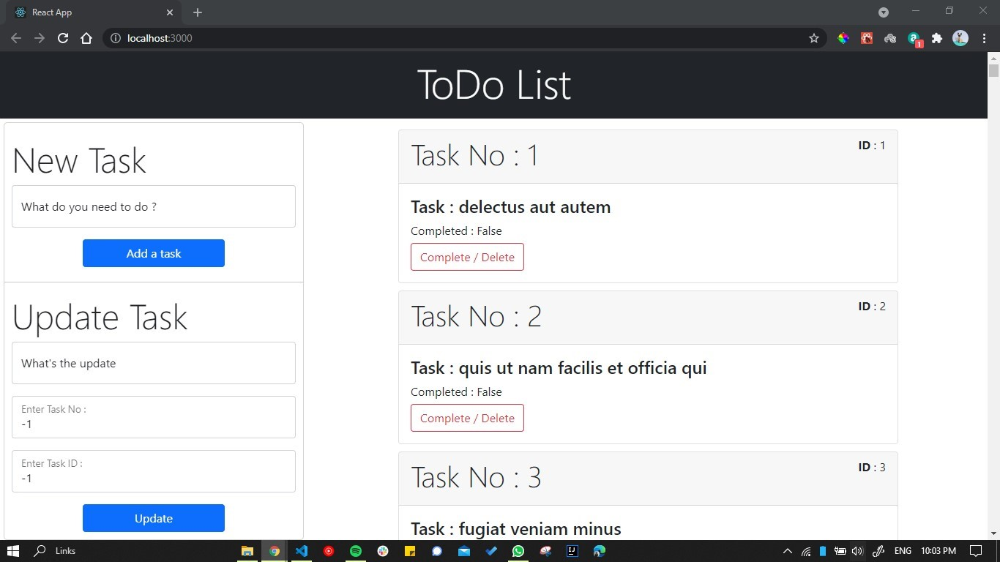

# ToDo List React App

### View this web page at https://nonuabi.github.io/Todolist-React-app/

## Features

* Data fetched from this [api_url](https://jsonplaceholder.typicode.com/todos)
* Add item to TODO List
* Update item from TODO List
* Delete item from TODO List

## Preview

 * Add new task input
 * Update task input
 
    
   
 * Task List
 
    
    
 * Complete Page
 
    

## How To Install

1.  Clone this project
2.  Start by installing npm if you don't have it already.
3.  Navigate to Project Directory by

    ~~~
    cd Todolist-React-app
    ~~~
4.  run following commands :
    
    ~~~
    npm install 
    npm start or react-scripts start
    ~~~

